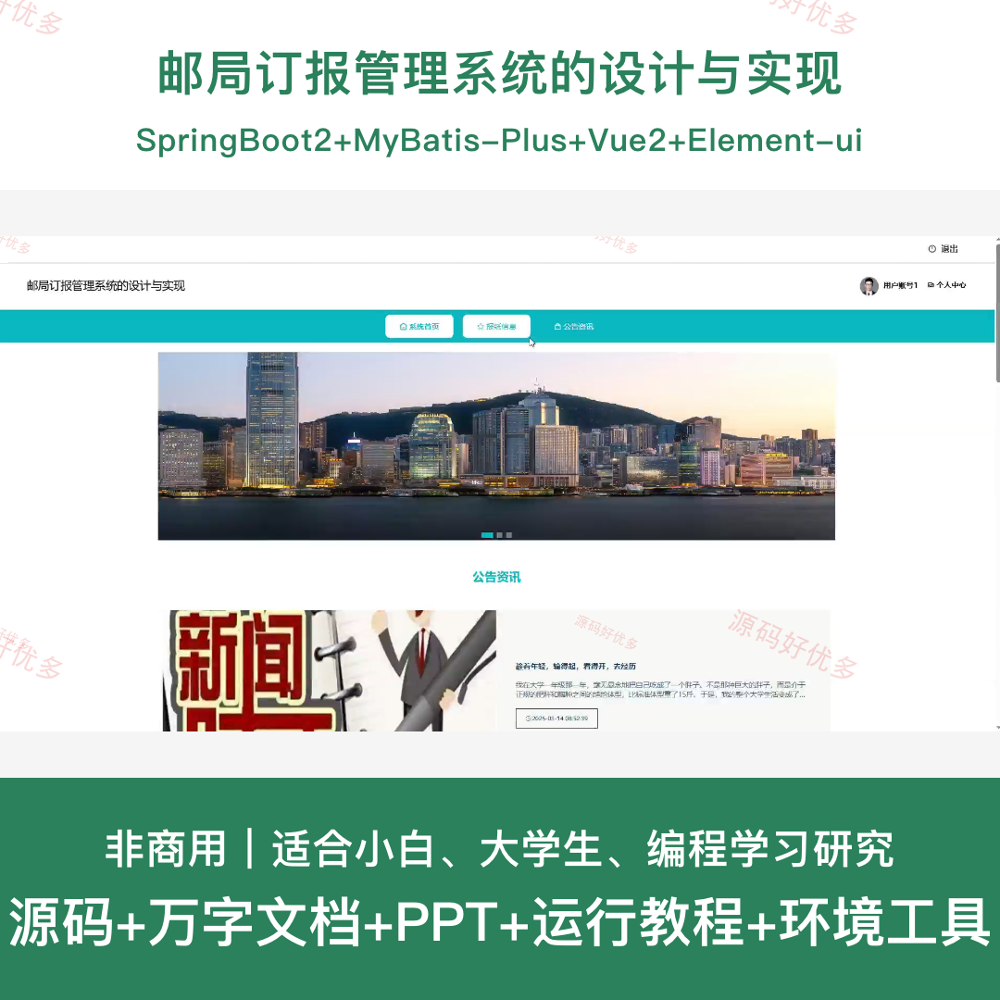
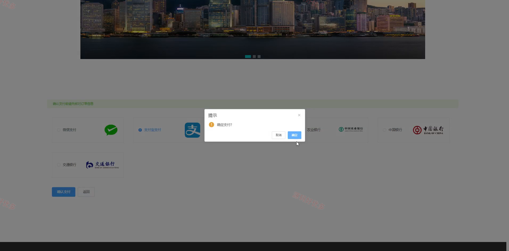
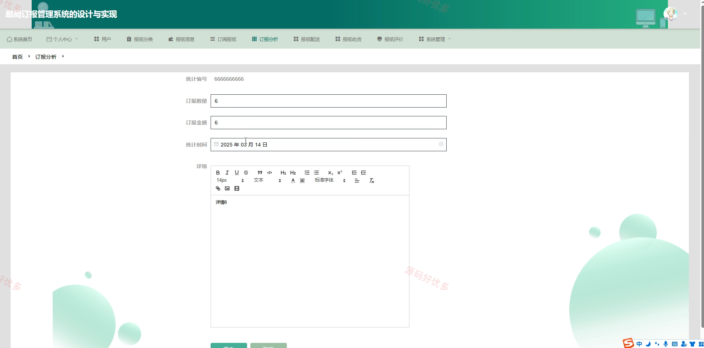
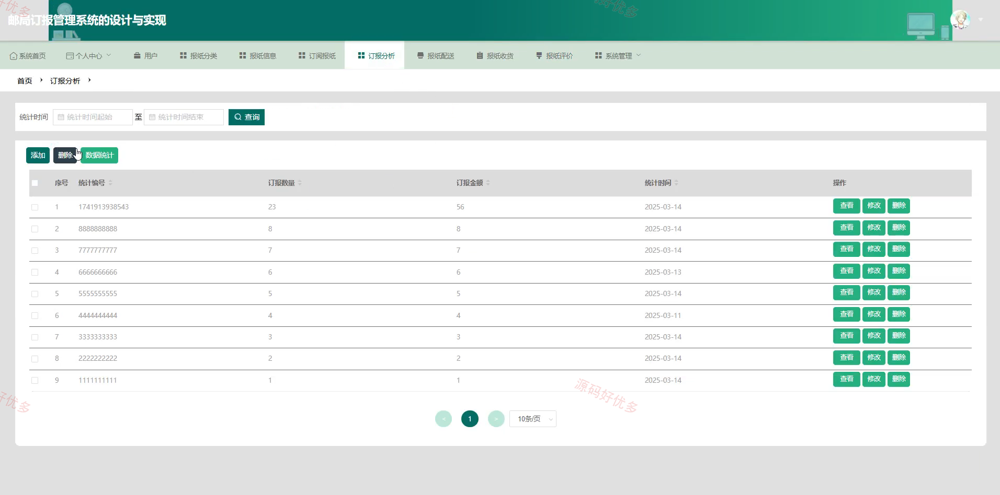
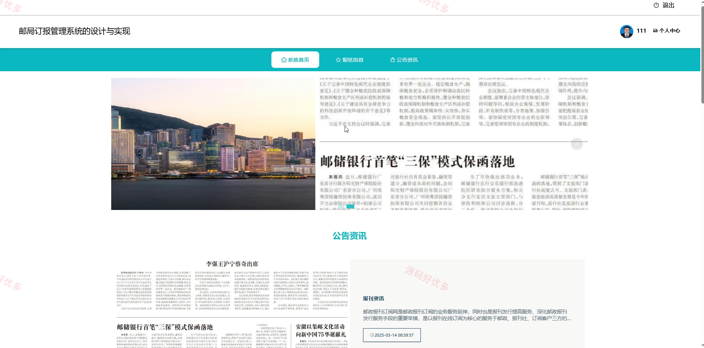
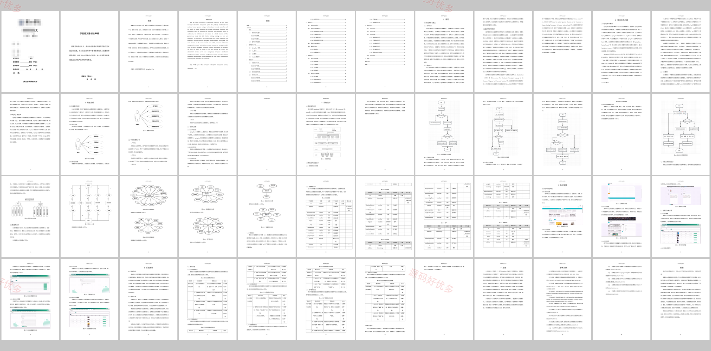

# springbootA566D
springbootA566D邮局订报管理系统的设计与实现
## 源码问题查看主页咨询

### 一、关键词
邮局订报管理系统、报纸订阅、报纸配送、订报分析、报纸评价

### 二、作品包含
源码+数据库+万字设计文档+PPT+全套环境和工具资源+本地部署教程

### 三、项目技术
前端技术： Html、Css、Js、Vue2.6、Element-ui
后端技术：Java、SpringBoot2.2.2、MyBatis-Plus

### 四、运行环境（以下版本亲测，其他版本兼容性请自行测试）
开发工具：IDEA/eclipse + VSCODE

数据库：MySQL5.7+（共17张表）

数据库管理工具：Navicat10以上版本

环境配置软件： JDK1.8 + Maven3.6.3

前端Nodejs：14+

浏览器：谷歌浏览器

### 五、项目介绍
项目编号：springbootA566D

邮局订报管理系统围绕报纸信息发布、用户在线订阅、配送收货、报纸评价和订报统计分析等流程建设，方便用户完成报纸订阅，也方便管理员维护报纸分类、订阅订单和配送评价数据。

角色：管理员、用户

用户功能：注册登录、报纸浏览、在线订阅、收货确认、报纸评价、个人中心。

管理员功能：用户管理、报纸分类管理、报纸信息管理、订阅报纸管理、配送/收货/评价管理、订报统计分析。

### 六、运行截图

